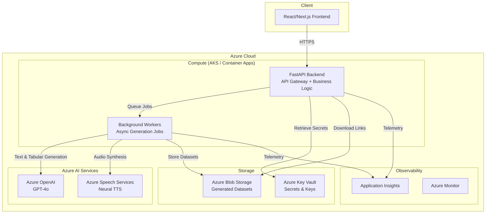
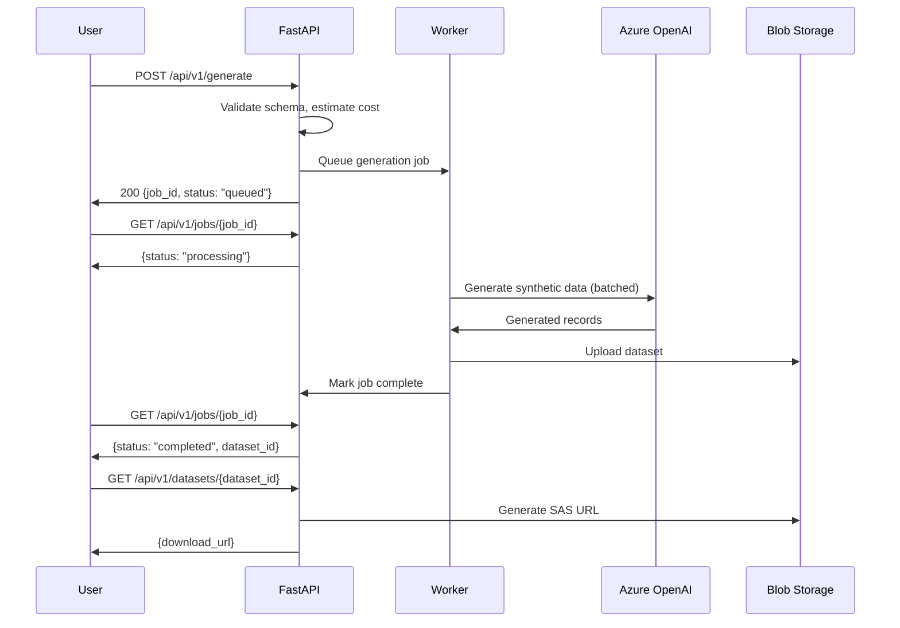

# SynthData — System Architecture

## Overview

SynthData is a multi-tier application that generates privacy-compliant synthetic data using Azure AI services. The system processes generation requests asynchronously and stores results in Azure Blob Storage for download.

## Architecture Diagram

## Component Details

### Frontend (React/Next.js)
- Schema builder UI for defining data structures
- Job dashboard for monitoring generation progress
- Dataset preview and download interface
- Authentication via Azure AD / GitHub OAuth

### API Backend (FastAPI)
- RESTful API for generation requests
- Schema validation and cost estimation
- Job orchestration and status tracking
- Authentication and rate limiting middleware

### Data Generators
| Generator | Input | AI Service | Output |
|-----------|-------|------------|--------|
| **Tabular** | Column schema + constraints | Azure OpenAI (GPT-4o) | JSON, CSV, Parquet |
| **Text** | Document type + domain + tone | Azure OpenAI (GPT-4o) | JSON array of documents |
| **Audio** | Voice + language + speakers | Azure Speech Services | WAV, MP3, OGG + transcripts |

### Background Workers
- Process generation jobs from a task queue
- Handle large datasets via chunked generation
- Report progress back to API for status polling
- Retry logic for transient Azure service failures

### Azure Blob Storage
- Stores generated datasets with configurable retention
- SAS token-based download URLs with expiration
- Lifecycle policies for automatic cleanup

### Azure Key Vault
- Stores Azure OpenAI API keys
- Stores Azure Speech subscription keys
- Stores storage connection strings
- Managed identity access from compute

## Data Flow

## Infrastructure

- **Compute**: Azure Kubernetes Service (AKS) or Azure Container Apps
- **Networking**: VNet-integrated with private endpoints for AI services
- **CI/CD**: GitHub Actions → Azure Container Registry → AKS
- **Secrets**: Azure Key Vault with managed identity
- **Monitoring**: Application Insights + Azure Monitor dashboards
